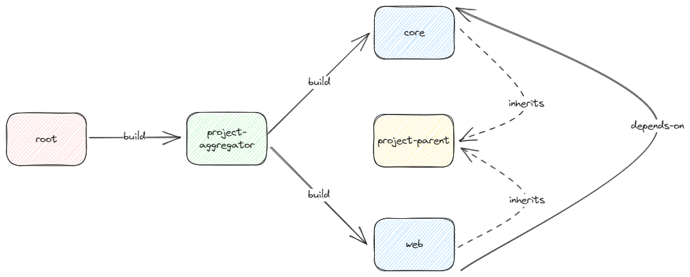

# Blogpost

See this [blogpost](https://bwgjoseph.com/maven-101-multi-module) for detailed explanation

- [Blogpost](#blogpost)
- [Introduction](#introduction)
- [Maven Reactor](#maven-reactor)
	- [Command Line Options](#command-line-options)
- [Type of POM](#type-of-pom)
	- [Aggregate POM](#aggregate-pom)
	- [Parent POM](#parent-pom)
	- [Aggregate vs Inheritance](#aggregate-vs-inheritance)
- [Dependency Management](#dependency-management)
- [Plugin Management](#plugin-management)
- [Building Project](#building-project)
- [Running Test](#running-test)
	- [All Test](#all-test)
	- [Specific Test Class](#specific-test-class)
	- [Specific Method](#specific-method)
	- [Specific Groups](#specific-groups)
- [JaCoCo Plugin](#jacoco-plugin)
	- [Single Module](#single-module)
	- [Multi Module](#multi-module)
- [Conclusion](#conclusion)
- [Source Code](#source-code)
- [References](#references)


# Introduction

This is a follow-up post to [Maven 101 - Basics](https://bwgjoseph.com/maven-101-basics). If you have not read that, I strongly suggest reading that before continuing on this.

In this post, I will be focusing on using `Maven` with `multi-module` setup using the following structure.

First, let's take a look at the project structure that will be used throughout this post.

```bash
root/
├── pom.xml
└── project/
    ├── pom.xml
    ├── core/
    │   └── pom.xml
    ├── project-parent/
    │   └── pom.xml
    └── web/
        └── pom.xml
```

`root/pom.xml` and `root/project/pom.xml` will be configured as `aggregate POM` while `root/project/project-parent/pom.xml` will be configured as `parent POM`.



The diagram above shows the relationship between each module

# Maven Reactor

It is important to understand what `Maven Reactor` is, and what it does before diving into `multi-module` setup.

`Maven Reactor` is the key mechanism that handles the `multi-module` project and does the following:

- Collects all the available modules to build
- Sorts the projects into the correct build order
- Builds the selected projects in order

> Taken directly from [Maven site](https://maven.apache.org/guides/mini/guide-multiple-modules.html)

`Maven Reactor` figure out the order of the modules by using `directed acyclic graph (DAG)` to determine the build order of the project.

Given the project structure above, if we compile the project, this will be the output.

```bash
> ./mvnw clean compile
[INFO] Scanning for projects...
[INFO] ------------------------------------------------------------------------
[INFO] Reactor Build Order:
[INFO]
[INFO] maven-101-multi-module-project-core                                [jar]
[INFO] maven-101-multi-module-project-web                                 [jar]
[INFO] maven-101-multi-module-project-aggregator                          [pom]
[INFO] maven-101-multi-module                                             [pom]
[INFO]
[INFO] ---------< com.bwgjoseph:maven-101-multi-module-project-core >----------
[INFO] Building maven-101-multi-module-project-core 0.0.1-SNAPSHOT        [1/4]
[INFO]   from project\core\pom.xml
[INFO] --------------------------------[ jar ]---------------------------------
```

As shown in the logs above, it shows the sequential order of the module to be build.

> Remember that `web` depends-on `core` so it ensure `core` builds first

## Command Line Options

The following command line switches are available:

- `--resume-from | -rf` - resumes a reactor from the specified project (e.g. when it fails in the middle)
- `--also-make | -am` - build the specified projects, and any of their dependencies in the reactor
- `--also-make-dependents | -amd` - build the specified projects, and any that depend on them
- `--fail-fast | -ff` - the default behavior - whenever a module build fails, stop the overall build immediately
- `--fail-at-end` - if a particular module build fails, continue the rest of the reactor and report all failed modules at the end instead
- `--non-recursive` - do not use a reactor build, even if the current project declares modules and just build the project in the current directory

> Shamelessly plug off [Maven site](https://maven.apache.org/guides/mini/guide-multiple-modules.html#command-line-options)

These are very useful commands to know while working with `multi-module` project setup.

Personally, I have issue using `-rf` when used along with `-f/-pl/-am` flags. Imagine while compiling, it fails at `web`, and if I fixed the issue and wanted to resume, I could have resume from `web` rather than running all over again using this command. But for some reason which I can't quite figure out what's the correct command to run to make sure it works correctly

```bash
./mvnw clean compile -f project -rf :web
```

# Type of POM

## Aggregate POM

> Also known as `Project Aggregation`

This POM file specifies which subprojects (or modules) to build and builds them in the specified order, managed by `The Reactor`.

Below shows the current project setup aggregator pom file.

```xml
<!-- root -->
<?xml version="1.0" encoding="UTF-8"?>
<project xmlns="http://maven.apache.org/POM/4.0.0" xmlns:xsi="http://www.w3.org/2001/XMLSchema-instance"
	xsi:schemaLocation="http://maven.apache.org/POM/4.0.0 https://maven.apache.org/xsd/maven-4.0.0.xsd">
	<modelVersion>4.0.0</modelVersion>

	<groupId>com.bwgjoseph</groupId>
	<artifactId>maven-101-multi-module</artifactId>
	<version>0.0.1-SNAPSHOT</version>

	<name>maven-101-multi-module</name>
	<description>Maven 101 - Multi Module</description>

    <packaging>pom</packaging>

	<modules>
		<module>project</module>
	</modules>

</project>

```

```xml
<!-- root/project -->
<?xml version="1.0" encoding="UTF-8"?>
<project xmlns="http://maven.apache.org/POM/4.0.0" xmlns:xsi="http://www.w3.org/2001/XMLSchema-instance"
	xsi:schemaLocation="http://maven.apache.org/POM/4.0.0 https://maven.apache.org/xsd/maven-4.0.0.xsd">
	<modelVersion>4.0.0</modelVersion>

	<groupId>com.bwgjoseph</groupId>
	<artifactId>maven-101-multi-module-project-aggregator</artifactId>
	<version>0.0.1-SNAPSHOT</version>

	<name>maven-101-multi-module-project-aggregator</name>
	<description>Maven 101 - Multi Module</description>

    <packaging>pom</packaging>

	<modules>
		<module>core</module>
		<module>web</module>
	</modules>

</project>
```

The key difference here between this and the `Simple POM` is that it has

- packaging
    - define as either jar/pom (default is jar)
- modules
    - listing of all the modules of the project

This is useful to group similar/related modules under this `Aggregated POM` so that one can run the command against this pom, and all the child modules will be triggered.

## Parent POM

> Also known as `Project Inheritance`

Similar to how `Simple POM` inherits from `Super POM`. We can define our own `Parent POM` with a set of configurations that can be shared across multiple modules.

```xml
<?xml version="1.0" encoding="UTF-8"?>
<project xmlns="http://maven.apache.org/POM/4.0.0" xmlns:xsi="http://www.w3.org/2001/XMLSchema-instance"
	xsi:schemaLocation="http://maven.apache.org/POM/4.0.0 https://maven.apache.org/xsd/maven-4.0.0.xsd">
	<modelVersion>4.0.0</modelVersion>
	<parent>
		<groupId>org.springframework.boot</groupId>
		<artifactId>spring-boot-starter-parent</artifactId>
		<version>3.1.3</version>
		<relativePath/> <!-- lookup parent from repository -->
	</parent>

	<groupId>com.bwgjoseph</groupId>
	<artifactId>maven-101-multi-module-project-parent</artifactId>
	<version>0.0.1-SNAPSHOT</version>

	<name>maven-101-multi-module-project-parent</name>
	<description>Maven 101 - Multi Module</description>

	<packaging>pom</packaging>

	<properties>
		<java.version>17</java.version>
        <error-handling-spring-boot-starter.version>4.2.0</error-handling-spring-boot-starter.version>
	</properties>

	<dependencies>
		<dependency>
			<groupId>org.springframework.boot</groupId>
			<artifactId>spring-boot-starter-web</artifactId>
		</dependency>
		<dependency>
			<groupId>io.github.wimdeblauwe</groupId>
			<artifactId>error-handling-spring-boot-starter</artifactId>
			<version>${error-handling-spring-boot-starter.version}</version>
		</dependency>
        <!-- omitted -->
	</dependencies>

	<build>
		<pluginManagement>
			<plugins>
				<plugin>
					<groupId>org.springframework.boot</groupId>
					<artifactId>spring-boot-maven-plugin</artifactId>
					<configuration>
						<excludes>
							<exclude>
								<groupId>org.projectlombok</groupId>
								<artifactId>lombok</artifactId>
							</exclude>
						</excludes>
					</configuration>
				</plugin>
			</plugins>
		</pluginManagement>
		<plugins>
			<plugin>
				<groupId>org.jacoco</groupId>
				<artifactId>jacoco-maven-plugin</artifactId>
				<version>0.8.10</version>
				<executions>
					<execution>
						<id>prepare-agent</id>
						<goals>
							<goal>prepare-agent</goal>
						</goals>
					</execution>
					<execution>
						<id>report</id>
						<phase>test</phase>
						<goals>
							<goal>report</goal>
						</goals>
					</execution>
				</executions>
			</plugin>
		</plugins>
	</build>

</project>
```

In `root/project/project-parent`, there's only 1 file, and that's `pom.xml` which is used to inherit by the individual modules. For example, in `core module`,

```xml
<?xml version="1.0" encoding="UTF-8"?>
<project xmlns="http://maven.apache.org/POM/4.0.0" xmlns:xsi="http://www.w3.org/2001/XMLSchema-instance"
	xsi:schemaLocation="http://maven.apache.org/POM/4.0.0 https://maven.apache.org/xsd/maven-4.0.0.xsd">
	<modelVersion>4.0.0</modelVersion>

	<!-- inherits from project-parent -->
	<parent>
		<groupId>com.bwgjoseph</groupId>
		<artifactId>maven-101-multi-module-project-parent</artifactId>
		<version>0.0.1-SNAPSHOT</version>
		<relativePath>../project-parent</relativePath>
	</parent>

	<artifactId>maven-101-multi-module-project-core</artifactId>
	<name>maven-101-multi-module-project-core</name>
	<description>Maven 101 - Multi Module</description>

</project>
```

We declare that `core module` inherits from `project-parent` POM.

This makes it easier to manage configuration, especially for dependencies (pinning) and plugins.

## Aggregate vs Inheritance

In short, using `Aggregate` means the parent **knows** who are the children, while using `Inheritance` means the parent **doesn't know** who are the children.

Running a command against `Aggregate` POM will invoke its children, but not for `Inheritance` POM.

You don't have to choose, as both can be used together in a single project.

It is very common for developer to mix both type of POM into a single `pom.xml` file which is fine. However, my personally opinion is to separate them out if possible, especially for slightly more complex project structure. Because separating them also means separating the concern of building the project, where I can use the same `aggregator` to build a group of modules but they don't necessarily share the same configuration.

# Dependency Management

It is important to understand the difference between using `dependencyManagement` and `dependencies`.

`dependencyManagement` and `dependencies` are both used to define dependency information, versioning, as well as configuration. The difference is `dependencyManagement` does not add an actual dependency to the project/module. Whereas, `dependencies` will add an actual dependency.

```xml
<dependencyManagement>
	<dependencies>
		<dependency>
			<groupId>io.github.wimdeblauwe</groupId>
			<artifactId>error-handling-spring-boot-starter</artifactId>
			<version>4.2.0</version>
		</dependency>
	</dependencies>
</dependencyManagement>
```

If we add the dependency to `dependencyManagement`, we will not be able to import and use the library. Until we explicitly add to under `dependencies` tag.

```xml
<dependencies>
	<dependency>
		<groupId>io.github.wimdeblauwe</groupId>
		<artifactId>error-handling-spring-boot-starter</artifactId>
	</dependency>
</dependencies>
```

Note that there is no need to declare the version anymore since it is now managed via `dependencyManagement`.

# Plugin Management

The concept is similar to `Dependency Management` as described above.

Plugin dependency configurations are usually a little bit more involved, and complex. Hence, being able to define once, and apply for all modules makes it much easier to re-use, and less error-prone.

```xml
<!-- parent pom -->
<build>
	<pluginManagement>
		<plugins>
			<plugin>
				<groupId>org.jacoco</groupId>
				<artifactId>jacoco-maven-plugin</artifactId>
				<version>0.8.10</version>
				<executions>
					<execution>
						<id>prepare-agent</id>
						<goals>
							<goal>prepare-agent</goal>
						</goals>
					</execution>
					<execution>
						<id>report</id>
						<phase>test</phase>
						<goals>
							<goal>report</goal>
						</goals>
					</execution>
				</executions>
			</plugin>
		</plugins>
	</pluginManagement>
</build>
```

Would you rather declare this once at the `parent-pom` and reuse it across all inherited modules? Or declare it at every child `pom.xml` like what is shown below?

```xml
<!-- child pom -->
<build>
	<plugins>
		<plugin>
			<groupId>org.jacoco</groupId>
			<artifactId>jacoco-maven-plugin</artifactId>
		</plugin>
	</plugins>
</build>
```

There is no need to declare the version, configuration, execution, or any other properties, unless, the intention is to overwrite it.

# Building Project

How to use `-am` to build project without installing the dependency modules

> -am: Builds the specified modules, and any of their dependencies in the reactor.

We know that `web` depends on `core`, and if we run the following command

```bash
./mvnw package -f project -pl core
```

We get the following error

```bash
> ./mvnw package -f project -pl web
[INFO] Scanning for projects...
[INFO]
[INFO] ----------< com.bwgjoseph:maven-101-multi-module-project-web >----------
[INFO] Building maven-101-multi-module-project-web 0.0.1-SNAPSHOT
[INFO]   from pom.xml
[INFO] --------------------------------[ jar ]---------------------------------
[WARNING] The POM for com.bwgjoseph:maven-101-multi-module-project-core:jar:0.0.1-SNAPSHOT is missing, no dependency information available
[INFO] ------------------------------------------------------------------------
[INFO] BUILD FAILURE
[INFO] ------------------------------------------------------------------------
[INFO] Total time:  1.881 s
[INFO] Finished at: 2023-09-03T23:35:36+08:00
[INFO] ------------------------------------------------------------------------
[ERROR] Failed to execute goal on project maven-101-multi-module-project-web: Could not resolve dependencies for project com.bwgjoseph:maven-101-multi-module-project-web:jar:0.0.1-SNAPSHOT: The following artifacts could not be resolved: com.bwgjoseph:maven-101-multi-module-project-core:jar:0.0.1-SNAPSHOT (absent): Could not find artifact com.bwgjoseph:maven-101-multi-module-project-core:jar:0.0.1-SNAPSHOT -> [Help 1]
[ERROR]
[ERROR] To see the full stack trace of the errors, re-run Maven with the -e switch.
[ERROR] Re-run Maven using the -X switch to enable full debug logging.
[ERROR]
[ERROR] For more information about the errors and possible solutions, please read the following articles:
[ERROR] [Help 1] http://cwiki.apache.org/confluence/display/MAVEN/DependencyResolutionException
```

That's because it's trying to find `com.bwgjoseph:maven-101-multi-module-project-core:jar:0.0.1-SNAPSHOT` either in local or remote repositories which is not available since we did not install locally or deploy it.

To overcome/resolve it, we can deploy it locally first by running

```bash
./mvnw install -f project -pl core
```

Which would have made it available locally, or we can actually use `-am` (also-make) command to build the dependent project first. This way, there is no need to ensure the dependent module is first deployed locally/remotely.

```bash
./mvnw package -f project -pl web -am
```

```bash
[INFO] Scanning for projects...
[INFO] ------------------------------------------------------------------------
[INFO] Reactor Build Order:
[INFO]
[INFO] maven-101-multi-module-project-core                                [jar]
[INFO] maven-101-multi-module-project-web                                 [jar]
[INFO]
[INFO] ---------< com.bwgjoseph:maven-101-multi-module-project-core >----------
[INFO] Building maven-101-multi-module-project-core 0.0.1-SNAPSHOT        [1/2]
[INFO]   from pom.xml
[INFO] --------------------------------[ jar ]---------------------------------
// omitted
[INFO] --- jar:3.3.0:jar (default-jar) @ maven-101-multi-module-project-web ---
[INFO] Building jar: Z:\Development\workspace\github\bwgjoseph\tutorials\maven-101-multi-module\project\web\target\maven-101-multi-module-project-web-0.0.1-SNAPSHOT.jar
[INFO] ------------------------------------------------------------------------
[INFO] Reactor Summary for maven-101-multi-module-project-core 0.0.1-SNAPSHOT:
[INFO]
[INFO] maven-101-multi-module-project-core ................ SUCCESS [ 21.384 s]
[INFO] maven-101-multi-module-project-web ................. SUCCESS [ 13.848 s]
[INFO] ------------------------------------------------------------------------
[INFO] BUILD SUCCESS
[INFO] ------------------------------------------------------------------------
[INFO] Total time:  36.158 s
[INFO] Finished at: 2023-09-03T23:38:58+08:00
[INFO] ------------------------------------------------------------------------
```

We can see that it now build `core` project before `web` module.

# Running Test

## All Test

To run all test for all modules under `/project`, run the following command

```bash
./mvnw test -f project
```

> -f: Selects an alternative POM file or directory containing a POM file

> This also gives us the benefit of having a single maven wrapper at root directory but being able to run any POM

It should give you the following result

```bash
> ./mvnw test -f project
[INFO] Scanning for projects...
[INFO] ------------------------------------------------------------------------
[INFO] Reactor Build Order:
[INFO]
[INFO] maven-101-multi-module-project-core                                [jar]
[INFO] maven-101-multi-module-project-web                                 [jar]
[INFO] maven-101-multi-module-project-aggregator                          [pom]
[INFO]
[INFO] ---------< com.bwgjoseph:maven-101-multi-module-project-core >----------
[INFO] Building maven-101-multi-module-project-core 0.0.1-SNAPSHOT        [1/3]
[INFO]   from core\pom.xml
[INFO] --------------------------------[ jar ]---------------------------------
```

## Specific Test Class

If wish to run a specific test class, then you can filter it using `-Dtest` parameter.

```bash
./mvnw test -f project -Dtest=SampleTests
```

Note that if we are on multi-module, it is better to indicate specific module, otherwise, it might fail if the test class does not exist in any other submodule.

```bash
./mvnw test -f project -pl core -Dtest=SampleTests
```

> -pl: select a specific set of projects to apply your goal

```bash
> ./mvnw test -f project -pl core -Dtest=SampleTests
[INFO] Scanning for projects...
[INFO]
[INFO] ---------< com.bwgjoseph:maven-101-multi-module-project-core >----------
[INFO] Building maven-101-multi-module-project-core 0.0.1-SNAPSHOT
[INFO]   from pom.xml
[INFO] --------------------------------[ jar ]---------------------------------
// omitted
[INFO] -------------------------------------------------------
[INFO]  T E S T S
[INFO] -------------------------------------------------------
[INFO] Running com.bwgjoseph.multimodule.SampleTests
[INFO] Tests run: 2, Failures: 0, Errors: 0, Skipped: 0, Time elapsed: 0.432 s - in com.bwgjoseph.multimodule.SampleTests
[INFO]
[INFO] Results:
[INFO]
[INFO] Tests run: 2, Failures: 0, Errors: 0, Skipped: 0
[INFO]
[INFO]
[INFO] --- jacoco:0.8.10:report (report) @ maven-101-multi-module-project-core ---
[INFO] Loading execution data file Z:\Development\workspace\github\bwgjoseph\tutorials\maven-101-multi-module\project\core\target\jacoco.exec
[INFO] Analyzed bundle 'maven-101-multi-module-project-core' with 5 classes
[INFO] ------------------------------------------------------------------------
[INFO] BUILD SUCCESS
[INFO] ------------------------------------------------------------------------
[INFO] Total time:  7.193 s
[INFO] Finished at: 2023-09-03T23:32:41+08:00
[INFO] ------------------------------------------------------------------------
```

To run multiple class, separate with `comma`

```bash
./mvnw test -f project -pl core -Dtest=SampleTests,AnotherSampleTests
```

## Specific Method

If wish to run a specific method within a class, use `#` like such

```bash
./mvnw test -f project -pl core -Dtest=SampleTests#test1
```

Similarly, you can chain up other test from other class using

```bash
./mvnw test -f project -pl core -Dtest="SampleTests#test1,AnotherSampleTests#test2"
```

> Remember to wrap with quotes

It is also possible to provide wildcard such as

```bash
./mvnw test -f project -pl core -Dtest=SampleTests#test*
```

This will run all test method name that starts with `test`

## Specific Groups

If wish to run through a group of test via `@Tags` or `@Tag` annotation

```java
@Tag("sample")
class SampleTests {}
```

```bash
./mvnw test -f project -pl core -Dgroups=sample
```

> It is also possible to exclude using `-DexcludedGroups`

# JaCoCo Plugin

The JaCoCo Maven plug-in provides the JaCoCo runtime agent to your tests and allows basic report creation.

> Quoted directly from [jacoco-maven](https://www.eclemma.org/jacoco/trunk/doc/maven.html)

In this section, I will be showing how the difference of generated jacoco report in a single module, and consolidate across various modules.

## Single Module

To generate code coverage, I added `jacoco-maven-plugin` to one of the module

```xml
<plugin>
	<groupId>org.jacoco</groupId>
	<artifactId>jacoco-maven-plugin</artifactId>
	<version>0.8.10</version>
	<executions>
		<execution>
			<id>prepare-agent</id>
			<goals>
				<goal>prepare-agent</goal>
			</goals>
		</execution>
		<execution>
			<id>report</id>
			<phase>test</phase>
			<goals>
				<goal>report</goal>
			</goals>
		</execution>
	</executions>
</plugin>
```

`prepare-agent` goal is setup to record the execution data such as lines executed. The execution data file is written to `/target/jacoco.exec`.

`report` goal is to read the file - `jacoco.exec`, and write the report and output to `/target/site/jacoco/index.html`

Once added, run the following

```bash
./mvnw test
```

Which works, but this is a bit more tricky for `multi-module` because `jacoco` would have generated report for each of the individual module but not as a aggregated report.

> Navigate to `./project/core/target/site/jacoco/index.html` to view the report

## Multi Module

In multi-module setup, having a aggregated jacoco report across all submodules is much better for reporting purpose. To do so, I created a `aggregated-report` submodule to house the aggregated report

In `aggregated-report` pom.xml

```xml
<!-- add dependencies on all the modules that we want to include -->
<dependencies>
	<dependency>
		<groupId>com.bwgjoseph</groupId>
		<artifactId>maven-101-multi-module-project-core</artifactId>
		<version>0.0.1-SNAPSHOT</version>
	</dependency>
	<dependency>
		<groupId>com.bwgjoseph</groupId>
		<artifactId>maven-101-multi-module-project-web</artifactId>
		<version>0.0.1-SNAPSHOT</version>
	</dependency>
</dependencies>

<!-- define report-aggregate for jacoco -->
<plugin>
	<groupId>org.jacoco</groupId>
	<artifactId>jacoco-maven-plugin</artifactId>
	<version>0.8.10</version>
	<executions>
		<execution>
			<id>report</id>
			<phase>prepare-package</phase>
			<goals>
				<goal>report-aggregate</goal>
			</goals>
		</execution>
	</executions>
</plugin>
```

Note that, we do not change the `jacoco` pom configuration that we defined previously in `/project-parent/pom.xml`. This configuration is to combine the reports so that running `./mvnw package -f project -pl aggregated-report -am` will create the aggregated report view

But.... this will trigger all the dependent submodules to run the `package` lifecycle again in order to collect the reports.

Is there a better way? Yes! By running the `report-aggregate` goal directory which will collect the jacoco result from the various dependency submodules instead of triggering them to run again (provided that those individual module has already ran the report).

```bash
./mvnw jacoco:report-aggregate -f project -pl aggregated-report -am
```

The number of reports that will be aggregated within `aggregated-report` submodule depends on which dependency you have included.

The `aggregated-report` submodule can be standalone, meaning it does not have to point to `/project-parent` as its parent pom (which is very often shown in example in the internet).

# Conclusion

While most of the examples are shown with `multi-module` setup, most of them should be the same for normal single module setup, just remove/ignore `-pl or -f or -am` argument (in most cases).

`Maven` has a pretty good support for `multi-module` setup, but I think that it isn't very well documented, at least in terms of samples that one could refer to and rely on.

By using it myself, I have gained much more understanding with regards to `Maven multi-module` setup and able to slowly take advantage of it bit by bit.

# Source Code

As usual, the full source code is available on [**GitHub**](https://github.com/bwgjoseph/tutorials/tree/main/maven-101-multi-module)

# References

- https://maven.apache.org/guides/mini/guide-multiple-modules.html
- https://stackoverflow.com/questions/7612309/maven-non-resolvable-parent-pom
- https://stackoverflow.com/questions/9500480/install-parent-pom-without-building-child-modules
- https://stackoverflow.com/questions/13031219/how-to-configure-multi-module-maven-sonar-jacoco-to-give-merged-coverage-rep
- https://www.baeldung.com/java-maven-reactor
- https://www.baeldung.com/maven-dependencymanagement-vs-dependencies-tags
- https://www.baeldung.com/maven-plugin-management